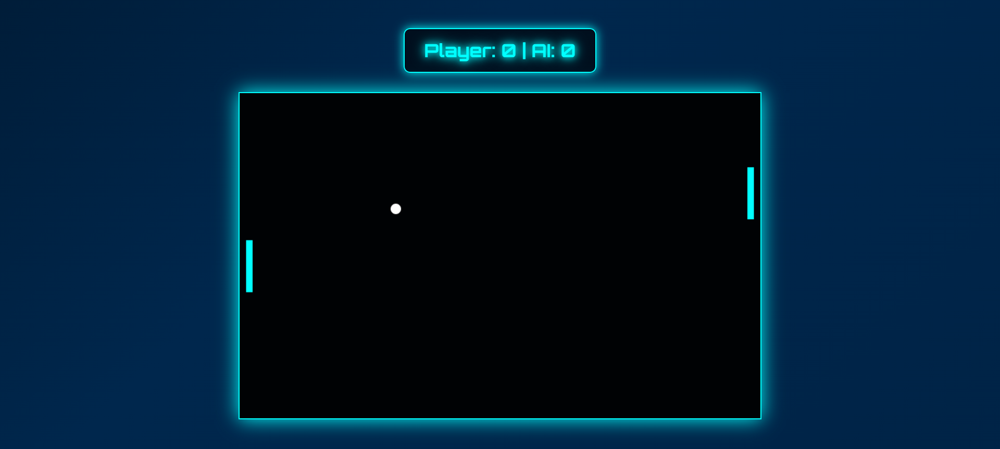

# Neon Pong Game

A futuristic neon-themed version of the classic **Pong** game built with **HTML, CSS, and JavaScript**. The game offers a neon glow experience with smooth animations, responsive design, and real-time score tracking.

## 🖼️ Preview
  

## 🚀 Features
- **Interactive Gameplay** – Control the player paddle using the mouse to hit the ball.
- **Multiple Difficulty Levels** – Choose between Easy, Medium, or Hard.
- **Real-Time Score Tracking** – Tracks and displays both player and AI scores.
- **AI Opponent** – A challenging AI that adjusts its speed based on difficulty.
- **Game Over Detection** – The game ends when either the player or AI reaches a score of 5.
- **Neon Glow Effects** – Futuristic neon visuals with glowing paddles and ball.
- **Responsive Design** – Optimized for both desktop and mobile devices.
- **Game Over Screen** – Displays your final score and provides options to return to the home page.

## 📜 Instructions
- Use the **Mouse** to move the player paddle up and down.
- Avoid letting the ball pass your paddle to prevent scoring for the AI.
- Score a point when the AI misses the ball.
- The game ends when either the player or AI reaches 5 points. You can then return to the home page or start a new game.

## 🛠️ Technologies Used
- **HTML** for the structure of the game.
- **CSS** for styling and animations.
- **JavaScript** for game logic and interactivity.
